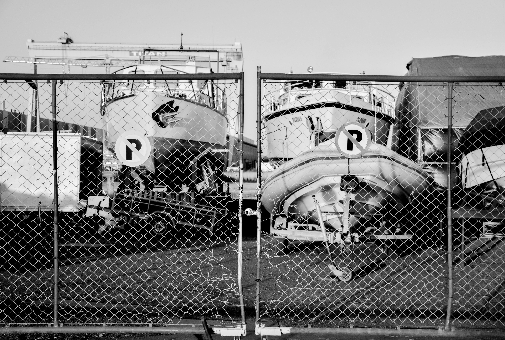
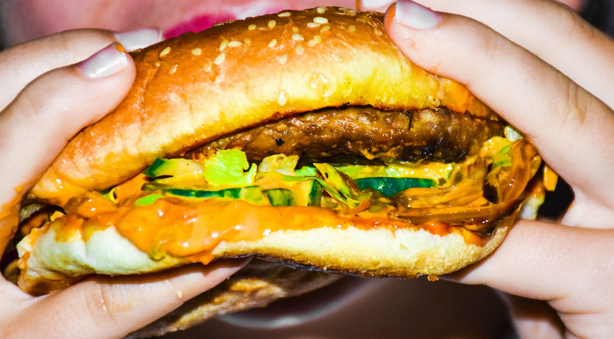
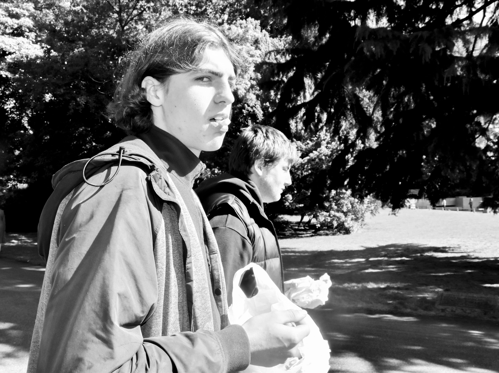
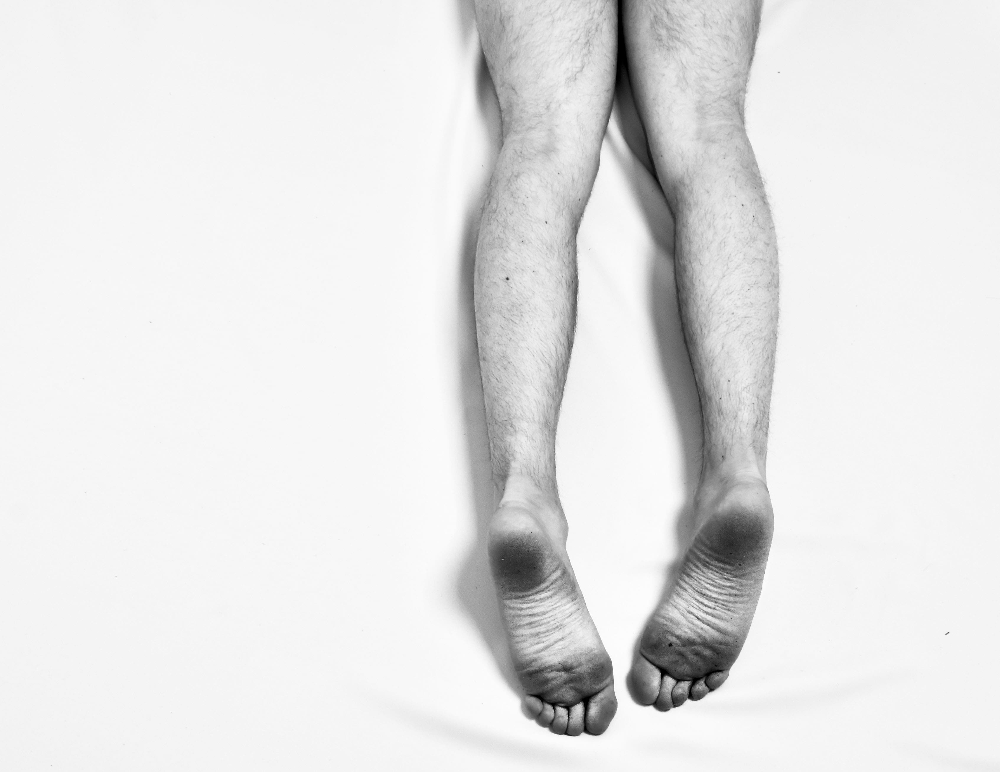
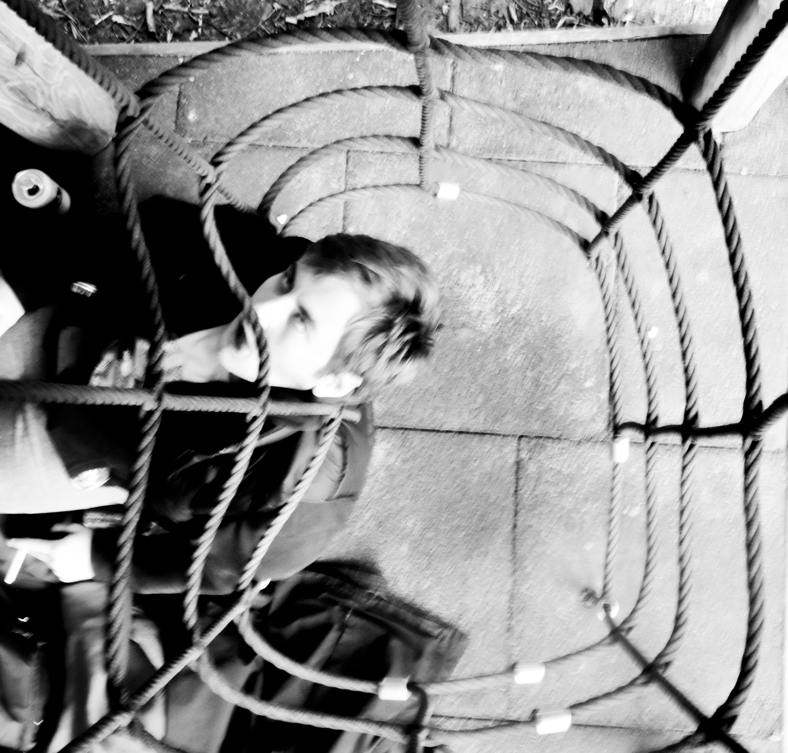

# Iwan_Dabrowski<!DOCTYPE html>
<html>
<head>
<title>Iwan Dabrowski</title>

</head>
<body>
	
IWAN DABROWSKI

	

	

<h1>Mijn naam is Iwan Dabrowski. Ik ben 28 jaar en leef in Gdynia.
Ik ben hier geboren en getogen. Op dit moment woon ik alleen in
een kleine flat vlakbij het winkelcentrum. Achter de hoek is mijn
favoriete restaurant, <a href='Kebab.html'>Kebab king</a>.Mijn moeder Ivanka woont bij haar
vriend. Mijn vader daarentegen woont alleen in een strandhut een
tijdje hier vandaan.
Als job werk ik nu bij een shell benzinestation. Veel verdien ik niet
maar ik kom net toe. Elke ochtend in de week ga ik hier te voet
naartoe. Ik ben al vroeg klaar met werken. Rond vier uur meestal.
Na het werk, ga ik naar mijn vrienden. Meestal gaan we dan naar
kebab king. Achteraf, gaan we ergens zitten en praten we wat bij
met een drankje.
Mijn Beste vriend is <a href='Mateusz.html'>Mateusz</a> .Ik zie hem elke dag. Hem ken ik ook
al mijn hele leven.
In de avond drinken we met de rest van onze vrienden graag wat
en misschien gaan we wel nog eens naar kebab king. Als de nacht
valt, verplaatsen we naar de beste club van Polen, Klub Pokład.
Hier gaan we helemaal <a href= 'Klub.html'>lazarus</a>, tot dat het tijd is voor mij om te
gaan werken. Dan begint mijn dag weer opnieuw.</h1>

</body>

<!DOCTYPE html>
<html>
<head>
<title>Kebab King</title>

</head>

<body>

KEBAB KING

<h1 style="margin-left: 50px; margin-top: 70px; text-align: center; margin-right: 20px">Mijn favoriete plaats. Waar ik mij nog meer <a href=Iwan.html>thuis</a> voel, is kebab king.
Het is niet echt een restaurant, maar toch noem ik het zo. Het eten
is het lekkerste in heel polen. Ik heb nog nooit zo een lekkere
frieten gegeten. Mijn lievelingseten is namelijk frietjes en kip. Of een
hamburger, pita etc. Als het maar van kebab king komt. </h1>

</body>
</html>

<!DOCTYPE html>
<html>
<head>
<title>Klub Poklad</title>

</head>

<body>
	

KLUB POKLAD

<h1 style="margin-right: 50px; margin-top: 100px; margin-left: 50px;">Wanneer ik uitga drink ik graag een beetje. Dan voel ik me wat
comfortabeler. Een tijdje geleden ben ik met andere dingen ook
gaan experimenteren. Ik vond het <a href='Kebab.html'>geweldig</a>. Het gevoel is zeer
bevrijdend. Dan denk ik aan niets meer. Geen zorgen of de mening
van andere mensen op wie dat ik echt ben. Ik wil het gevoel dat ik
heb voor <a href='Mateusz.html'>Mateusz</a> stoppen hiermee. Als ik niets voel, voel ik dit ook
niet. Ik kan het niet langer verbergen.
Maar, soms loopt het uit de hand. Vorige week, kreeg ik iets
aangesmeerd van een man in Klub Poklad. Ik wist eigenlijk niet
eens wat het was. Een soort poeder. Maar ik was zo onder de
invloed van andere dingen, dat ik gewoon een impulsieve beslissing
nam. Vanaf dat het in mijn lichaam zat voelde ik dat het te laat was.
Mijn organen stopte om de beurt met functioneren. Voor dat ik het
wist stopte mijn hele lichaam met werken en heb ik Mateusz nooit
meer terug gezien.</h1>

</body>

<!DOCTYPE html>
<html>
<head>
<title>Mateusz Nowak</title>

</head>
<body>
	

MATEUSZ NOWAK

<h1> Mateusz Nowak, is mijn beste vriend. <a href=Iwan.html>Ik</a> zou alles voor hem doen. Ik
ken hem al mijn hele leven en zou alles voor hem doen.Op een dag
zijn we samen gaan <a href='KLUB.html'>feesten</a>, hierna zijn we samen in de zee gaan
zwemmen. Het was echt een magische avond. Mateusz heeft een
kapsel om jaloers op te zijn en ogen om in te verdrinken. Als hij zijn
sigaret aansteekt doet hij dat altijd met een lucifer.Ik vind het zo
charmant. En wanneer hij zo liefelijk lacht is het bijna betoverend. Ik
zie hem graag. </h1> 

</body>

